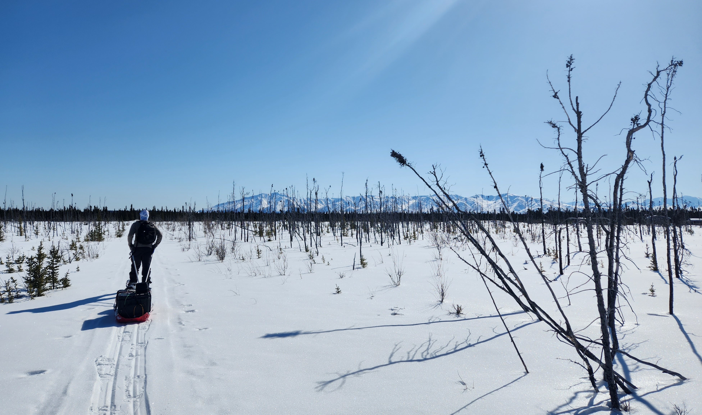

In Fall 2024 I graduated from Boise State University with a PhD in Geosciences where I focused on modeling snow optical properties from imaging spectroscopy and lidar measurements. Currently I'm a JPL postdoctoral researcher in the Uncertainty Quantification and Statistical Analysis Group continuing this work.

*SnowEx field work near Delta Junction, Alaska in April 2023.*
