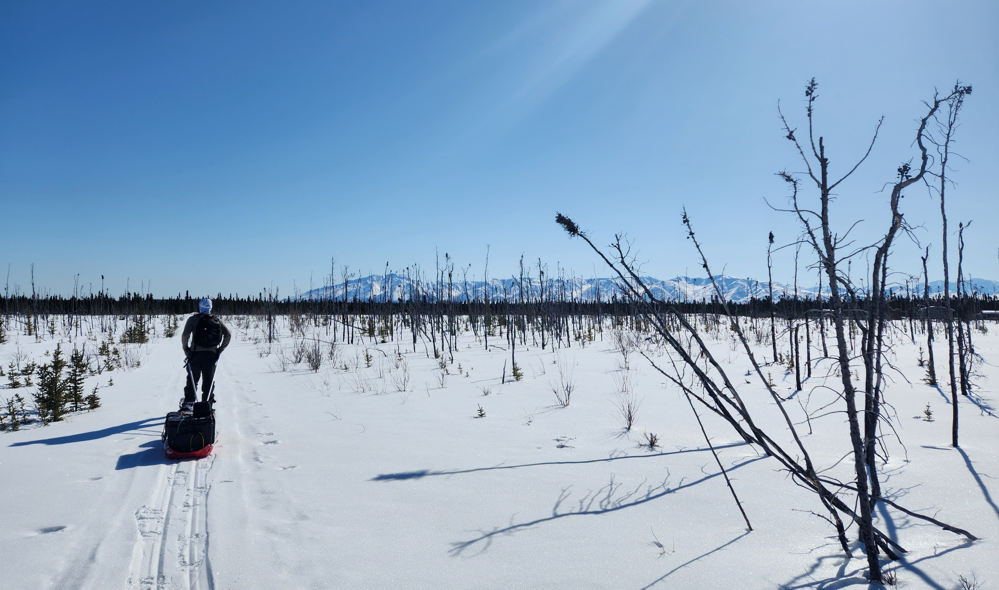

Currently I am a Postdoctoral Researcher within the Uncertainty Quantification and Statistical Analysis Group at NASA's Jet Propulsion Laboratory (JPL). I work on the retrieval of geophysical properties from imaging spectroscopy data (e.g., EMIT, AVIRIS-NG), with an emphasis on improving quantification of uncertainties in coupled atmosphere-surface forward models. 

Before JPL, I did my Ph.D. at the Department of Geosciences at Boise State University under Dr. Nancy Glenn where we focused on retrievals of snow surface properties from imaging spectroscopy data.

*SnowEx field work near Delta Junction, Alaska in April 2023.*
